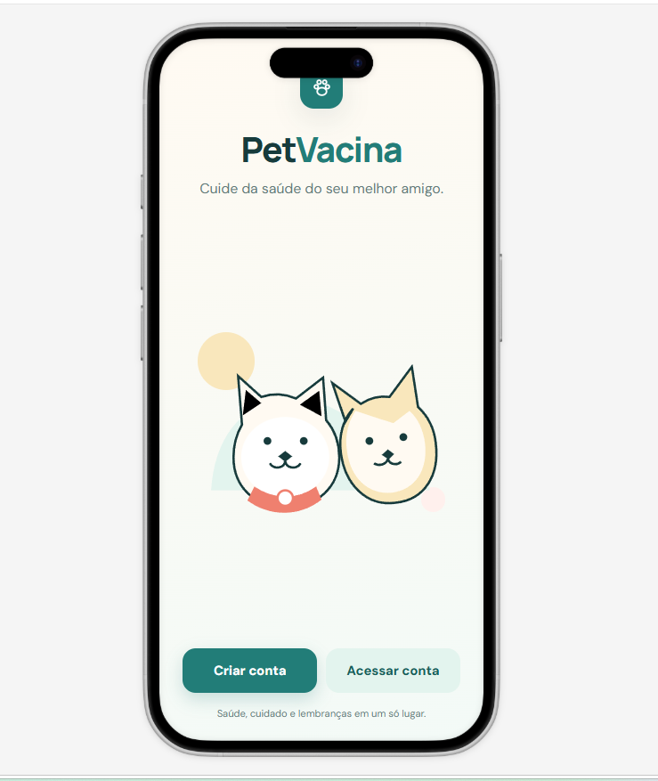
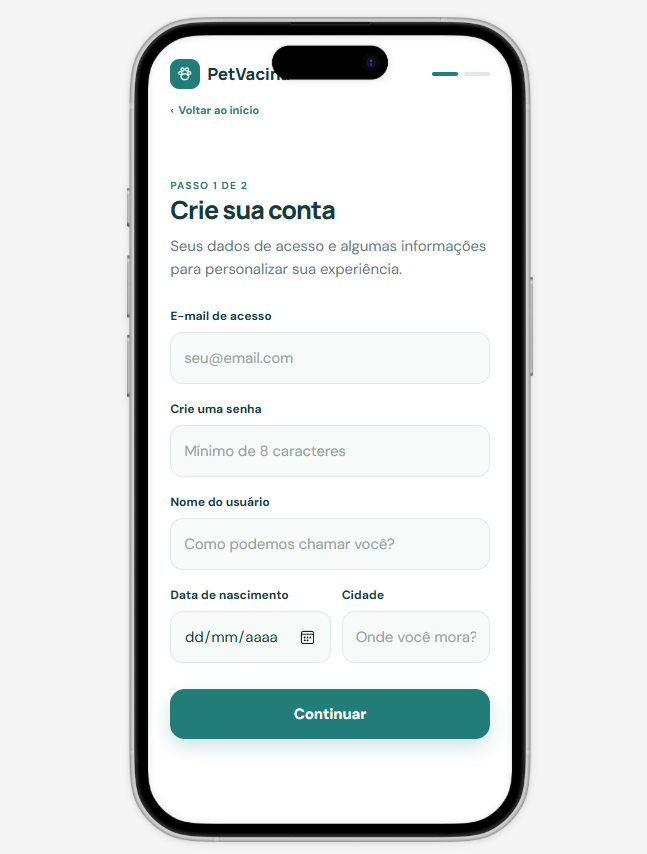
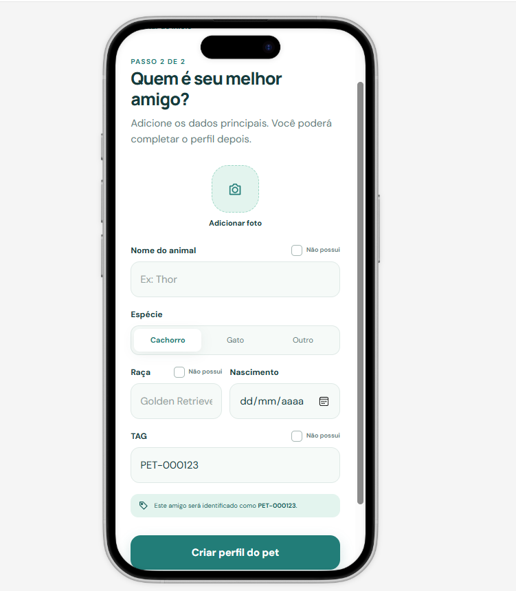
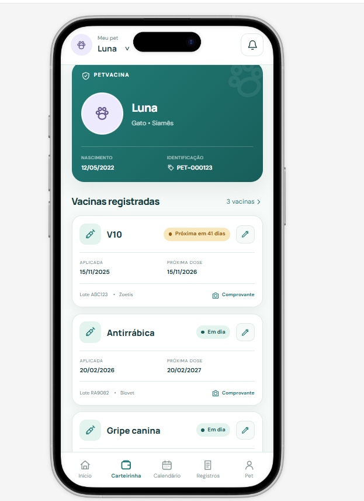
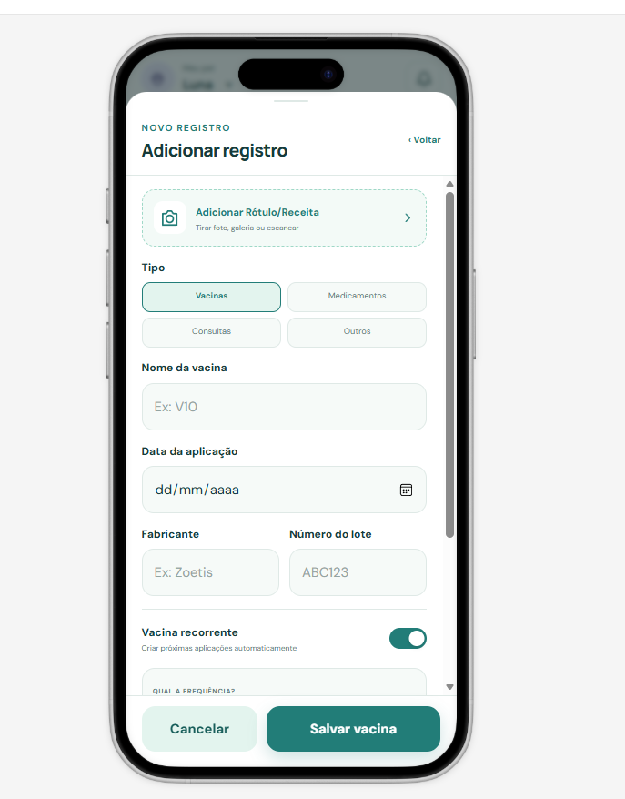
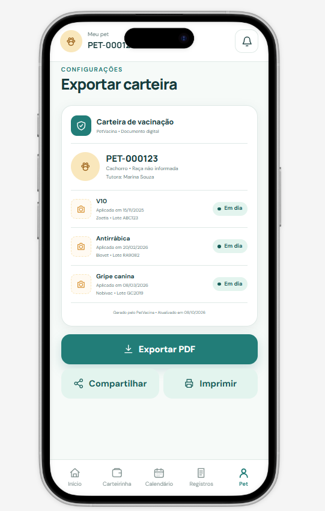

# PetVacina
Aplicativo Mobile de Carteira de Vacinação para Pets, que permite o registro de vacinas, consultas, medicamentos e demais serviços oferecidos aos seus pets, com registro de datas e notificações para lembretes de futuras vacinas.

## Objetivo do projeto
O objetivo do projeto é desenvolver um aplicativo que facilite o controle da vacinação e saúde dos pets por meio de uma carteira digital com histórico e lembretes.

Durante o desenvolvimento foram utilizados conceitos como: 
* Controle de versão com Git e Github
* Prototipação da interface gráfica com Figma
* Pesquisa de campo com Tutores
* Sistema de Login/Cadastro

## Infraestrutura Técnica      

🖥️ Backend

🌐 Frontend web

📖 Frameworks / ORM

💾 Banco de dados

⚙️ Ferramentas 

## Funcionalidades do Sistema

* Cadastrar Animais
* Cadastrar Vacinas
* Cadastrar Medicamentos
* Cadastrar Consultas
* Editar Cadastro
* Excluir Cadastros
* Consultar Acões cadastradas
* Agendar Notificações de Futuras Vacinações
* Histórico de Saúde
* Cadastrar Tutor
* Salvar Arquivos de Imagem das Vacinas aplicadas
* Exportar documento com os registros de ações efetuadas
* Registro de Medicamentos 

## **Diagrama de Casos de Uso**

## **Diagrama de Sequencia**

## Interface

Protótipo navegável: [Clique para ver no Figma](https://www.figma.com/make/CLBqJauktFiMoSFdTHkDYF/PetVacina-App-Development?code-node-id=0-6&p=f&t=9PV7MpIVr41SGDYo-0&fullscreen=1)

### **Telas do Sistema**

*Clique em uma tela para ampliar.*

| **Login** | **Registro de Usuário** |
|:---------:|:------------:|
|  |  |

| **Cadastro de Pet** | **Tela do Usuário** |
|:------------------------:|:------------------------:|
|  |  |

| **Registrar Vacina** | **Exportar Dados** |
|:------------------------:|:------------------------:|
|  |  |

## Criador

* Marcio Roberto Jr.

